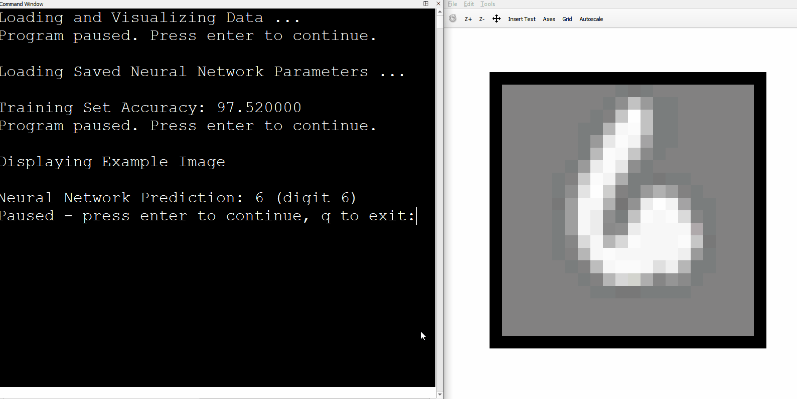

# Regularized Logistic Regression and NN Hand Written Digits Analyzer
 An implementation with both regularized logistic regression and a neural network to recognize hand written digits from a dataset.
ex3.m runs the regularized logistic regression model, and ex3_nn.m runs the neural network model.

